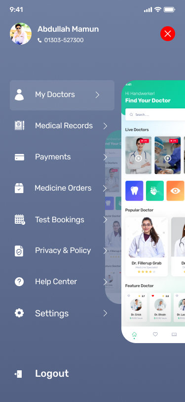

# Doctor Hunt 🩺

**Doctor Hunt** is a Flutter-based mobile application designed to simplify the process of booking doctor appointments and ordering pharmacy medicines. It provides a smooth and user-friendly experience from onboarding to secure checkout.

## ✨ Features

- Beautiful onboarding screens
- User authentication (Sign up & Login)
- Browse doctors and book appointments
- Pharmacy section with medicine cart
- Credit card payment integration
- Address management with stepper widget
- Promo code and order confirmation

## 📸 Screenshots

### Splash Screen


### OnBoarding Screen
.jpg)

### Sign Up Screen


### Login Screen


### Menu Screen


### Doctor Screen


### Pharmacy Screen


## 🚀 Getting Started

To run the app locally:

```bash
git clone https://github.com/gendy3010/DoctorHunt.git
cd DoctorHunt
flutter pub get
flutter run
